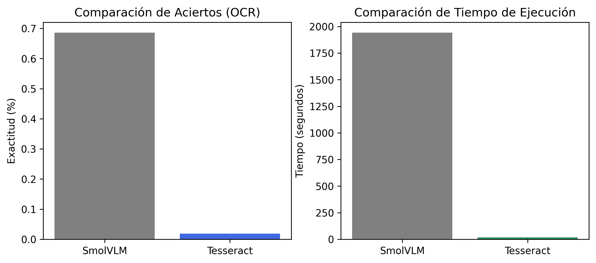

# Práctica 4 y 4b: Prototipo de detección de matrículas, coches y personas


## Práctica 4
## Requisitos de ejecución
Para ejecutar el cuaderno correctamente, necesitas tener lo siguiente:
- Python  
- GPU con soporte CUDA (opcional, pero recomendable para acelerar los modelos).  
- Librerías de Python:
  - `ultralytics` (YOLO)  
  - `torch`  
  - `opencv-python`  
  - `pytesseract`  
  - `transformers`  
  - `Pillow`  
  - `numpy`  
  - `glob`, `os`, `json`, `csv`, `re` (estándar de Python)  
- Tesseract OCR instalado en el sistema y configurado en el código si es necesario.
- Acceso a los modelos:
  - YOLOv11n (detector y tracker de personas y vehículos)  
  - Modelo entrenado para detectar matrículas  
  - OCR Pytesseract y SmolVLM  
Con esto, ya tienes todo lo que hace falta para ejecutar el cuaderno.

### Lista y descripción de tareas realizadas 

#### Objetivo
El objetivo es preparar un prototipo que procese vídeos y detecte personas, coches y matrículas con su correspondiente texto, volcando el resultado en un vídeo y anotaciones en un fichero csv.


#### Elaboración de un dataset de matrículas
Para empezar, se ha creado un dataset de matrículas de coches. Para ello, entre distintos estudiantes de la asignatura se creó una carpeta compartida en la cual fuimos subiendo las imágenes.

Posteriormente, descargamos todas las imágenes y las renombramos usando un script de PowerShell que usa un hash para nombrar la imagen, para que cada una tuviese un nombre único. Tras esto, procedimos mediante un script de PowerShell a separar nuestro dataset en tres conjuntos: train con un 80% de las imágenes y validation y test con un 10% cada una.

Tras esto, se procedió a realizar el etiquetado de todas las imágenes con el programa Labelme, que generaba un archivo JSON con el mismo nombre que la imagen con las anotaciones.

Finalmente, para pasar las anotaciones del formato Labelme a YOLO, usamos otro script de Python.

#### Entrenamiendo de un modelo capaz de detectar matrículas en imagenes
Posteriormente, se hicieron diversos entrenamientos hasta que conseguimos el detector de matrículas que se usa en la práctica. El código de entrenamiento que se muestra en el cuaderno muestra la configuración con la que conseguimos el modelo que estamos utilizando.

#### Implementación del prototipo
El prototipo a implementar debe cumplir las siguientes especificaciones:

- Detecte y siga a las personas y vehículos presentes.
- Detecte las matrículas de los vehículos presentes.
- Cuente el total de cada clase.
- Vuelque a disco un vídeo que visualice los resultados.
- Genere un archivo CSV con el resultado de la detección y seguimiento. Se sugiere un formato con al menos los siguientes campos:
```csv
fotograma, tipo_objeto, confianza, identificador_tracking, x1, y1, x2, y2, matrícula_en_su_caso, confianza, mx1, my1, mx2, my2, texto_matricula
```
Para ello, y utilizando el modelo YOLO11n, que incluye detector y tracker de personas y coches, iteramos en todos los frames del vídeo y se lo pasamos al modelo de YOLO usando el método _track() con el tracker ByteTrack, que se encargará de seguir a los objetos detectados y asignarles un identificador. Posteriormente, si se encuentran regiones que se correspondan con coches en las predicciones del modelo, se itera entre ellas y se le aplica el modelo que ha sido entrenado por nosotros para detectar la matrícula. A las matrículas, además, se las pasa por dos OCR: Pytesseract y SmolVLM. Debido a los recursos que consume SmolVLM, se ha optado por separar la ejecución, y por tanto tenemos dos celdas en el cuaderno que tratan el vídeo y generan un fichero CSV. Con los datos que se obtienen del modelo YOLO, el entrenado por nosotros y los OCR, se generan los diferentes campos del fichero de salida y se escriben para cada objeto en cada frame.

Finalmente, para realizar la cuenta, lo que se hace es leer los ficheros CSV generados y se discrimina primero entre si son personas o vehículos, y se añaden sus identificadores al conjunto correspondiente. Como estos no admiten duplicados, el tamaño del conjunto será equivalente a la cuenta. 

#### Conclusiones
Hay que tener en cuenta que el tracker no es perfecto, y que puede asignarle un identificador nuevo a un objeto que ya había aparecido en el vídeo, por ejemplo, cuando otro lo cubre, como pasa en el vídeo de ejemplo cuando pasa un coche en circulación por delante de los coches estacionados.
Nuestro modelo, detecta mejor las matrículas cuanto más cerca están de la cámara. Probablemente debido a que es más fácil obtener imagenes de coches estacionados que en circulación. 

En la siguiente carpeta compartida se puede ver el prototipo en funcionamiento sobre el vídeo de prueba proporcionado. Están todas las
versiones, tanto el que se genera con pytesseract como con SmolVLM [Carpeta compartida](https://drive.google.com/drive/u/1/folders/1A9bAFEXjTL0uQNPBMKWiG5_bhnBCeSlE)

Los siguientes ficheros _.csv_ contienen las anotaciones pertinentes para la entrega de la práctica
- Usando como OCR Pytesseract: `./detecciones_pytesseract.csv`
- Usando como OCR SmolVLM: `./detecciones_SmolVLM.csv`

Respecto al modelo la siguiente figura muestra resultados del entrenamiento. 

   

Como se puede apreciar, el modelo ha dado bastante buen resultado. Destacan tanto una _precision_ como un _recall_ bastante alto, superiores al 90%, lo que nos indica que ha las mayoría de las predicciones son correctas y que acierta la gran parte de las muestras que se le proporcionan. Asímismo si nos fijamos los valores del _mean average precision_ vemos que son bastante altos incluso para la que tiene un umbral del 95%, lo que nos indica que además hace bastantes detecciones bastante precisas.
Por otro lado si nos fijamos en los valores de pérdidas tanto para _train_ como para _val_ vemos que tienen unas curvas muy similares, lo que nos hace pensar que no hay _overfitting_ y que se podría seguir entrenando durante más épocas. 

#### Extras
Hemos implementado el extra de anonimizar a las personas y vehículos presentes en un vídeo, para ello lo que se hace es en la región de interés de los objetos detectados por el modelo Yolo (coches y personas) se les aplica un Gaussian Blur. 

## Práctica 4B

### Lista y descripción de tareas realizadas

En la práctica 4b, el objetivo principal es evaluar y comparar la precisión y velocidad de los siguientes modelos OCR  (Pytesseract y SmolVLM) sobre un subconjunto de nuestro dataset, en el que etiquetamos aparte de la zona de la matrícula, un texto con la matrícula. Para realizar este etiquetado utilizamos la herramienta Labelme, mediante la cual obtuvimos un archivo en formato JSON que se usa para comprobar si las predicciones  de cada modelo son correctas.

#### Obtención de predicciones con SmolVLM

Para obtener las predicciones mediante el modelo SmolVLM se siguieron los siguientes pasos:
1. se configuró el entorno para poder utilizar la GPU con el modelo SmolVLM
2. Se cargó el modelo en GPU
3. Se aplicó el modelo YOLO entrenado para detectar la región de la matrícula de cada imagen.
4. Se recortó la región y se pasó a SmolVLM junto con el siguiente prompt:
	- "Can you give me the text in the license plate of the image? (only plate text)"
5. Se procesó la respuesta y se limpió para obtener únicamente el texto  de la matrícula.
6. Se almacenaron todas las predicciones en un CSV (ocr_detections/predicciones_placas_SmolVLM.csv).
   
#### Obtención de predicciones con Pytesseract

De forma análoga al caso de SmolVLM, se aplicó el mismo conjunto de imágenes pero utilizando Pytesseract como OCR, empleando también nuestro detector de matrículas entrenado con nuestro dataset para aislar la región de la matrícula.  
Posteriormente, se guardaron los resultados en ocr_detections/tesseract.csv.

#### Comparación y análisis de resultados

Para evaluar la precisión de ambos OCR, se compararon las predicciones almacenadas en los ficheros CSV con las anotaciones reales de cada imagen, disponibles en formato JSON (generadas por Labelme durante la creación del dataset).


El proceso de comparación consistió en:
- Leer las predicciones desde los CSV (predicciones_placas_SmolVLM.csv y tesseract.csv).
- Para cada predicción, abrir el archivo JSON correspondiente y extraer la descripción de la matrícula real.
- Comparar ambas cadenas (en minúsculas y sin espacios) para comprobar si la predicción era correcta.
- Calcular el número de aciertos, el total de fallos y la exactitud de cada OCR mediante la fórmula:


Finalmente, se generaron dos gráficos comparativos:
- Porcentaje de aciertos.
- Tiempo de ejecución total.

Estos gráficos se guardaron en la siguiente imagen:


#### Conclusiones

Los resultados muestran que el modelo SmolVLM logra una mayor precisión en el reconocimiento del texto de las matrículas en comparación con Pytesseract, sin embargo, su tiempo de ejecución y consumo de recursos es significativamente superior.

## Autoría
   - Tycho Quintana Santana.
   - Ian Samuel Trujillo Gil.

## Uso de IA
Apoyo para la generación de los dos scripts de PowerShell

